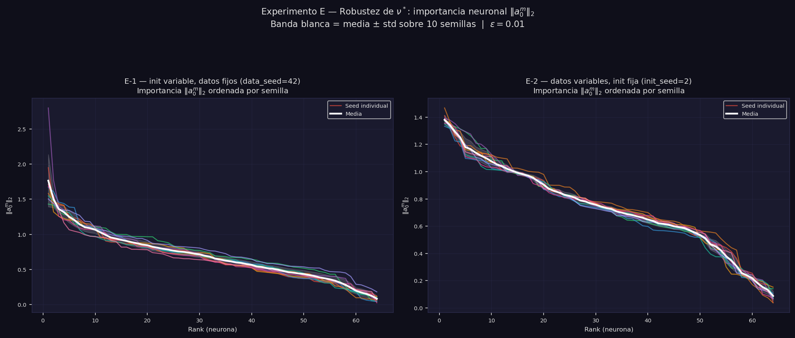
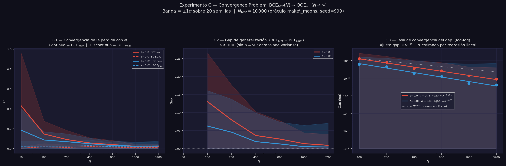

# Documentación técnica — Neural ODEs de Campo Medio con Regularización Entrópica

**Referencia:** Daudin, S. & Delarue, F. (2025). *Genericity of the Polyak-Łojasiewicz inequality for mean-field Neural ODEs with entropic regularization.* arXiv:2507.08486.

**Código:** `python -m codigo` — ejecuta todos los experimentos. Opciones: `--experiment {A,B,C,D,E,F,G}`, `--epochs N`.

---

## Índice

- [1. Contexto y motivación](#1-contexto-y-motivación)
- [2. Marco teórico](#2-marco-teórico)
- [3. Implementación](#3-implementación)
- [4. Experimento A — Evolución de $\gamma_t$](#4-experimento-a--evolución-de-gamma_t-marginal-en-x)
- [5. Experimento B — Efecto del parámetro $\varepsilon$](#5-experimento-b--efecto-del-parámetro-varepsilon)
- [6. Experimento C — Verificación empírica de la condición PL](#6-experimento-c--verificación-empírica-de-la-condición-pl)
- [7. Experimento D — Genericidad: robustez a semillas](#7-experimento-d--genericidad-robustez-a-semillas)
- [8. Experimento E — Robustez de $\nu^*$ (make\_moons)](#8-experimento-e--robustez-de-nu-make_moons)
- [9. Experimento F — Convergencia en make\_circles](#9-experimento-f--convergencia-en-make_circles)
- [10. Experimento G — Problema de convergencia ($N \to \infty$)](#10-experimento-g--problema-de-convergencia-n-to-infty)
- [11. Conclusiones](#11-conclusiones)
- [Referencias](#referencias)

---

## 1. Contexto y motivación

Las redes neuronales profundas se pueden entender como sistemas de control: cada capa transforma la representación de los datos, y el objetivo es aprender los parámetros de esa transformación para que la representación final sea fácilmente clasificable. En el límite de capas continuas, esta idea da lugar a las **Neural ODEs** (Chen et al., 2018). En el límite de neuronas infinitas por capa, aparece el **límite de campo medio**.

El paper de Daudin & Delarue (2025) estudia la intersección de ambos límites y demuestra dos resultados sorprendentes:

- La existencia de un **minimizador estable único** es genérica (ocurre para casi toda distribución inicial de datos).
- Cerca de ese minimizador, se satisface la **desigualdad de Polyak-Łojasiewicz (PL)**, lo que garantiza **convergencia exponencial** del descenso en gradiente hacia el óptimo global — sin ninguna hipótesis de convexidad.

Este documento presenta la verificación empírica de estos resultados sobre los datasets `make_moons` y `make_circles` de scikit-learn.

---

## 2. Marco teórico

### 2.1 Neural ODEs en el límite de campo medio

Una red ResNet profunda con $L$ capas converge, cuando $L \to \infty$, a la **ODE**:

$$\frac{dX_t}{dt} = F(X_t, t), \quad t \in [0, T], \quad X_0 = \text{dato de entrada}$$

Si además cada capa tiene $M \to \infty$ neuronas, la distribución de parámetros converge a una **medida** $\nu_t \in \mathcal{P}(A)$ y el campo vectorial efectivo es:

$$F(x, t) = \int_A b(x, a) \, d\nu_t(a)$$

El problema de optimización consiste en encontrar la trayectoria de medidas $(\nu_t)_{t \in [0,T]}$ que minimiza el coste total.

### 2.2 Campo vectorial prototípico

El paper usa el campo prototípico (Ejemplo 1.1, ec. 1.8):

$$b(x, a) = \sigma(a_1 \cdot x + a_2) \cdot a_0, \quad \sigma = \tanh$$

donde $a = (a_0, a_1, a_2) \in A = \mathbb{R}^{d_1} \times \mathbb{R}^{d_1} \times \mathbb{R}$.

El campo efectivo con $M$ partículas es:

$$F(x, t) \approx \frac{1}{M} \sum_{m=1}^{M} \sigma\left(a_1^m \cdot x + a_2^m\right) \cdot a_0^m$$

que es una **red neuronal de una capa oculta** con $M$ neuronas y parámetros que varían en el tiempo $t$.

### 2.3 Ecuación de continuidad

La distribución de datos $\gamma_t$ en el instante $t$ evoluciona según la ecuación de continuidad (ec. 1.3):

$$\partial_t \gamma_t + \text{div}_x\left(F(x, t) \, \gamma_t\right) = 0$$

La solución formal es $\gamma_t = (\phi_t)_{\sharp} \gamma_0$: el flujo $\phi_t$ desplaza solo la componente de features $X_0^i \to X_t^i$; la etiqueta $Y_0^i$ permanece invariante bajo el flujo.

### 2.4 Regularización entrópica y control óptimo

La función objetivo del problema de control es (ec. 1.6):

$$J(\gamma_0, \nu) = \underbrace{\int L(x, y) \, d\gamma_T(x, y)}_{\text{coste terminal (BCE)}} + \underbrace{\varepsilon \int_0^T \mathcal{E}(\nu_t \mid \nu^\infty) \, dt}_{\text{penalización entrópica (KL)}}$$

El prior es $\nu^\infty(da) \propto e^{-\ell(a)} \, da$ con potencial **supercoercivo**:

$$\ell(a) = c_1 |a|^4 + c_2 |a|^2, \quad c_1 = 0.05, \quad c_2 = 0.5$$

La supercoercividad ($c_1 > 0$) garantiza la **desigualdad de log-Sobolev** para $\nu^\infty$, que es el ingrediente técnico que conecta la regularización entrópica con la condición PL.

El control óptimo $\nu_t^*$ tiene la **forma de Gibbs** (ec. 1.9):

$$\nu_t^*(da) \propto \exp\left(-\ell(a) - \frac{1}{\varepsilon} \int b(x, a) \cdot \nabla u_t(x,y) \, d\gamma_t\right) da$$

donde $u_t$ es la función de valor (solución de Hamilton-Jacobi-Bellman hacia atrás).

### 2.5 La condición Polyak-Łojasiewicz

La **condición PL** establece que existe $\mu > 0$ tal que:

$$\|\nabla J(\theta)\|^2 \geq 2\mu \cdot (J(\theta) - J^*)$$

Si la condición PL se cumple con tasa de aprendizaje $\eta$, la convergencia es **exponencial**:

$$J(\theta_k) - J^* \leq (1 - 2\eta\mu)^k \cdot (J(\theta_0) - J^*)$$

La condición PL es **más débil que la convexidad estricta** pero suficiente para garantizar convergencia global al mínimo.

### 2.6 Los dos Meta-Teoremas

**Meta-Teorema 1** (genericidad): Existe un conjunto abierto y denso $\mathcal{O}$ de condiciones iniciales $\gamma_0$ tal que para todo $\gamma_0 \in \mathcal{O}$, el problema de control tiene un único minimizador **estable**.

**Meta-Teorema 2** (condición PL local): Para $\gamma_0 \in \mathcal{O}$ y $\varepsilon > 0$, la condición PL se cumple localmente cerca del minimizador estable. La constante $\mu > 0$ existe para cualquier $\varepsilon > 0$, por pequeño que sea, pero la PL solo está garantizada en un entorno del óptimo, no en todo el espacio de parámetros.

---

## 3. Implementación

### 3.1 Dataset

Se usa `make_moons` de scikit-learn con $N = 400$ puntos y ruido $\sigma = 0.12$, estandarizado con `StandardScaler`. El experimento F usa `make_circles` ($N=400$, noise=0.08, factor=0.5). El experimento G varía $N \in \{25, 50, 100, 200, 400, 800\}$ para estudiar la convergencia en número de partículas.

En el lenguaje del paper, los datos constituyen la **distribución inicial empírica**:

$$\gamma_0 = \frac{1}{N} \sum_{i=1}^{N} \delta_{(X_0^i,\, Y_0^i)} \;\in\; \mathcal{P}(\mathbb{R}^{d_1} \times \mathbb{R}^{d_2})$$

### 3.2 Arquitectura

```
X_0 ∈ ℝ²  →  [ODE: dX/dt = F(X,t), t ∈ [0,1]]  →  X_T ∈ ℝ²  →  [lineal W,b]  →  logit
```

| Componente | Ecuación |
|---|---|
| Campo vectorial | $F(x,t) = W_0 \tanh(W_1 [x, t]^\top + b_1)$ |
| Integrador | RK4, 10 pasos, $dt = 0.1$, error global $O(dt^4) = 10^{-4}$ |
| Clasificador | $\text{logit} = W \cdot X_T + b$ |

**Parámetros:** $M = 64$ neuronas, $T = 1.0$, `n_steps = 10` → 387 parámetros entrenables (384 en `MeanFieldVelocity` + 3 en el clasificador lineal).

> **Restricción del espacio de controles.** En el paper, $\nu_t$ es una trayectoria arbitraria sobre $\mathcal{P}(A)$. La implementación concatena $t$ como feature y mantiene $(W_0, W_1, b_1)$ estáticos, lo que restringe el control a la familia donde $a_0^m$ y $a_1^m$ son **constantes en $t$** y solo $a_2^m(t)$ varía linealmente. El campo $F(x,t)$ sí depende genuinamente de $t$, pero el espacio de control es un subconjunto estricto del del paper. Las garantías teóricas se verifican empíricamente en este subespacio.

### 3.3 Función objetivo y término de regularización

$$J(\theta) = \underbrace{\frac{1}{N}\sum_{i=1}^N \text{BCE}(\text{logit}_i, y_i)}_{\text{coste terminal}} + \varepsilon \cdot \underbrace{\frac{1}{N_\theta} \sum_j \left[c_1 \theta_j^4 + c_2 \theta_j^2\right]}_{\text{prior energético: } \mathbb{E}_{\nu}[\ell(a)]}$$

El segundo término es el **término de energía** de la KL: $\mathbb{E}_{\nu_t}[\ell(a)]$. Para parámetros puntuales ($\nu_t = \frac{1}{M}\sum_m \delta_{\theta_m}$), la entropía diferencial $H(\nu_t)$ es técnicamente $-\infty$ respecto a un prior continuo, por lo que solo el término de energía es accesible. Equivale a regularización L4+L2 (*weight decay* polinomial) y actúa como **prior energético** $\nu^\infty$.

> **Nota:** el paper define $|a|^4 = (|a|^2)^2$; la implementación calcula $\sum_j \theta_j^4$ (suma de cuartas potencias escalares, sin términos cruzados). Ambos son supercoercivos, por lo que las garantías teóricas se preservan.

La **entropía** de la KL se implementa en los experimentos B, E, F y G mediante **SGLD** (Stochastic Gradient Langevin Dynamics, ver §3.4).

### 3.4 Modos de optimización

La función `train()` implementa tres modos, seleccionados según el objetivo de cada experimento:

| Modo | Parámetro | Experimentos | Fórmula de actualización |
|---|---|---|---|
| **Adam** (defecto) | — | A, D | Adam + cosine annealing |
| **SGD puro** | `use_sgd=True` | C | $\theta \leftarrow \theta - \eta \nabla J$ (lr constante) |
| **pSGLD** | `use_sgld=True` | B, E, F, G | $\theta \leftarrow \text{Adam}(\theta, \nabla J) + \sqrt{2\eta\varepsilon M_t}\,\xi$, $\xi \sim \mathcal{N}(0, I)$ |

**pSGLD** (preconditioned Stochastic Gradient Langevin Dynamics, Li et al. 2016) combina Adam como optimizador base con ruido de Langevin **acoplado al precondicionador** $M_t$ de Adam:

$$M_t[j] = \min\!\left(\frac{1}{\sqrt{\hat{v}_t[j]} + \delta},\; 1\right), \qquad \hat{v}_t[j] = \frac{v_t[j]}{1 - \beta_2^t}$$

donde $\hat{v}_t[j]$ es el segundo momento sesgado-corregido del parámetro $j$, y $\delta = 10^{-8}$ es el término de estabilización de Adam. El clamp en 1 evita explosión de ruido en direcciones planas ($\hat{v}_t \approx 0 \Rightarrow M_t \to \infty$ sin cota). La implementación accede al estado interno de Adam (`exp_avg_sq`, `step`, `betas`) en cada paso.

El acoplamiento entre ruido y precondicionador es **matemáticamente necesario**: con ruido isotrópico ($\sigma$ constante para todos los $j$), la parte estocástica se desacopla de $M_t$ y la cadena de Markov ya no converge a $\nu^* \propto \exp(-J(\theta)/\varepsilon)$. El ruido precondicionado garantiza que la distribución estacionaria sea exactamente la de Gibbs bajo el precondicionador de Adam.

Adam como base es igualmente necesario: SGD puro no converge porque los gradientes de la BCE son del orden de $10^{-5}$ y Adam adapta el lr por parámetro. Con $\varepsilon = 0$ el ruido es exactamente cero (Adam estándar). El cosine annealing sobre la tasa $\eta_s$ satisface las condiciones de Robbins-Monro ($\eta_s \to 0$).

**SGD puro** (sin ruido, lr constante) se usa en el experimento C porque la condición PL es una propiedad **geométrica** del paisaje de $J$, independiente del optimizador. Con cosine annealing el lr $\to 0$ al final aplana $J(\theta^s) - J^*$ artificialmente, contaminando la estimación de $\hat{\mu}$.

---

## 4. Experimento A — Evolución de $\gamma_t$ (marginal en $x$)

**Objetivo:** Visualizar cómo la ODE transforma $\gamma_0$ (make_moons, no separable) en $\gamma_T$ (linealmente separable). Optimizador: Adam + cosine annealing.

**Configuración:** $\varepsilon = 0.01$, $M = 64$, $T = 1.0$, 800 épocas.


**Layout 2×4:**

- **Fila superior (izq. a der.):** $\gamma_{t=0}$ (lunas entrelazadas), $\gamma_{t=0.20}$, $\gamma_{t=0.50}$, curvas de pérdida ($J$ total, BCE, prior energético).
- **Fila inferior:** $\gamma_{t=0.70}$, $\gamma_{t=1.0}$ (clases separadas), trayectorias de 40 partículas ($t=0$ punto → $t=T$ estrella), frontera de decisión en $\mathbb{R}^2$.

El rectángulo discontinuo en cada snapshot indica la extensión original de $\gamma_0$, permitiendo ver el desplazamiento acumulado. La frontera en el espacio original es no lineal pues incorpora toda la geometría del flujo $\phi_T$, aunque el clasificador final sea lineal sobre $X_T$.

---

## 5. Experimento B — Efecto del parámetro $\varepsilon$

**Objetivo:** Estudiar cómo la intensidad de la regularización entrópica $\varepsilon$ afecta a la convergencia, la distribución de parámetros y el campo de velocidad aprendido. Optimizador: **SGLD** (SGD + cosine annealing + ruido de Langevin), coherente con el rol de $\varepsilon$ como temperatura.

**Configuración:** $\varepsilon \in \{0, 0.001, 0.01, 0.1, 0.5\}$, misma inicialización (misma semilla antes de cada modelo), 700 épocas.

### B1 — Curvas de convergencia


Los ejes de $J$ y $\mathcal{E}$ están recortados ($J \leq 0.5$, $\mathcal{E} \leq 0.15$) para que $\varepsilon=0.5$ no domine la escala. Las curvas de accuracy muestran la señal bruta (trazo fino) y una media móvil de ventana 15 (trazo grueso).

**Panel izquierdo (pérdida total $J$):** Todos los modelos convergen. Para $\varepsilon$ mayores, el valor asintótico $J^*$ es más alto porque incluye mayor penalización de regularización. La velocidad de convergencia es comparable entre todos los $\varepsilon$.

**Panel central (accuracy):** Todos los modelos alcanzan ≥99% de exactitud, incluyendo $\varepsilon = 0.5$. La distinción entre $\varepsilon = 0$ y $\varepsilon > 0$ no es en accuracy sino en **garantías teóricas de convergencia**.

**Panel derecho (reg. supercoerciva de energía $\mathcal{E}/N_\text{params}$):** Con $\varepsilon = 0$ la penalización es la más alta (parámetros alejados del prior porque nada los atrae). A medida que $\varepsilon$ aumenta, los parámetros se concentran cerca del origen, reduciendo $\mathcal{E}$.

### B2 — Fronteras de decisión + campo de velocidad


Layout **2×5** (una columna por $\varepsilon$):

- **Fila superior:** Frontera de decisión $P(y=1|x) = 0.5$ en $\mathbb{R}^2$. Mayor $\varepsilon$ produce fronteras más suaves y regulares; la zona de transición entre clases es más ancha (el modelo reduce su certeza lejos de la frontera).
- **Fila inferior:** Campo de velocidad $F(x, t=0.5)$ a mitad del flujo. Dirección normalizada con flechas; color = magnitud. El campo muestra cómo la ODE empuja las dos clases en direcciones opuestas para crear la separación que el clasificador lineal después explota.

---

## 6. Experimento C — Verificación empírica de la condición PL

**Objetivo:** Comprobar que $\|\nabla J(\theta)\|^2 \geq 2\mu \cdot (J(\theta) - J^*)$ se cumple empíricamente durante todo el entrenamiento, verificando el Meta-Teorema 2.

**Configuración:** Experimento **autocontenido** — entrena sus propios modelos con **SGD + lr constante** (`use_sgd=True`, $\varepsilon \in \{0, 0.001, 0.01, 0.1, 0.5\}$, 700 épocas). No reutiliza modelos de B. El lr constante garantiza que $J^*$ sea el mínimo geométrico real del gradient flow, sin artefactos del cosine annealing que aplanarían $J(\theta^s) - J^*$ artificialmente.


### C1 — Diagrama log-log: $\|\nabla J\|^2$ vs $(J - J^*)$

Cada punto es una época. La **línea blanca discontinua** es la referencia $\|\nabla J\|^2 = 2(J-J^*)$ ($c=1$). La **línea naranja** es $2\hat{\mu}_\text{min}(J-J^*)$, la cota real estimada con la constante PL más conservadora entre todos los $\varepsilon$.

Los puntos están por encima de la línea naranja, confirmando PL con constante $\hat{\mu} > 0$. La pendiente $\approx 1$ en log-log es la firma visual de la condición PL: $\|\nabla J\|^2$ crece proporcionalmente a $(J-J^*)$.

### C2 — Convergencia exponencial (escala semilog)

El exceso de coste $J(\theta^s) - J^*$ en escala logarítmica muestra caída aproximadamente lineal (decay exponencial), consistente con:

$$J(\theta_s) - J^* \lesssim (J(\theta_0) - J^*) \cdot e^{-2\mu s}$$

Con SGD + lr constante el aplanamiento final refleja genuina convergencia al mínimo, sin artefactos del scheduler.

### C3 — Constante PL estimada $\hat{\mu}$ por $\varepsilon$

Estimada como el percentil 10 del ratio $\|\nabla J\|^2 / (2(J - J^*))$. El paper garantiza $\mu > 0$ para todo $\varepsilon > 0$ pero **no** que $\mu$ crezca con $\varepsilon$. Empíricamente $\hat{\mu}$ puede decrecer con $\varepsilon$ porque la regularización eleva $J^*$ (mayor denominador en el ratio). El resultado clave es $\hat{\mu} > 0$ para todo $\varepsilon > 0$.

### C4 — Ratio PL vs época (escala log)

El ratio $\|\nabla J\|^2 / (2(J - J^*))$ se mantiene positivo y por encima de $\hat{\mu}$ (línea naranja) durante todo el entrenamiento. La condición PL se cumple no solo al inicio sino también en las etapas tardías, confirmando la hipótesis **local** del Meta-Teorema 2.

---

## 7. Experimento D — Genericidad: robustez a semillas

**Objetivo:** Verificar empíricamente el Meta-Teorema 1: distintas inicializaciones de parámetros y distintos datasets deben converger al mismo tipo de solución. Optimizador: Adam + cosine annealing.

**Configuración:** $n = 10$ seeds, 500 épocas, $\varepsilon \in \{0, 0.01\}$.

- **D1:** Dataset fijo (`data_seed=42`), inicialización aleatoria (seeds 0–9). Mide robustez al *paisaje de pérdida* desde distintos puntos de partida.
- **D2:** Inicialización fija (`init_seed=2`), dataset aleatorio (seeds 0–9). Mide robustez a la *distribución de datos* $\gamma_0$ — directamente el enunciado de genericidad.
- **D3:** `data_seed = init_seed = s` para cada $s$. Escenario más realista: ninguna fuente de aleatoriedad está controlada.


**Layout 3×3** (una fila por sub-experimento):
- **Columna izquierda:** Curvas de pérdida individuales (colores) + media ±1σ (blanco) para $\varepsilon=0$.
- **Columna central:** Ídem para $\varepsilon=0.01$.
- **Columna derecha:**
  - D1: Boxplots de $\hat{\mu}_{PL}$ y $J^*$ entre seeds para $\varepsilon=0$ (rojo) vs $\varepsilon=0.01$ (verde).
  - D2/D3: Fronteras de decisión superpuestas ($\varepsilon=0.01$) — nube de puntos de todos los datasets como fondo (alpha muy bajo), contornos $P(y=1|x)=0.5$ de los runs con acc ≥ 95%.

### Interpretación

| Sub-experimento | $\gamma_0$ | $\theta_0$ | Fuente de variabilidad |
|---|---|---|---|
| D1 | Fija (seed=42) | Aleatoria (0–9) | Paisaje de pérdida (init) |
| D2 | Aleatoria (0–9) | Fija (seed=2) | Distribución de datos |
| D3 | Aleatoria ($s$) | Aleatoria ($s$) | Ambas combinadas |

La banda ±1σ de D3 debe ser la más ancha (combina ambas fuentes). Con $\varepsilon=0.01$ la condición PL garantiza $\hat{\mu} > 0$ cerca del óptimo; la regularización no reduce necesariamente la varianza entre seeds, sino que asegura la existencia de un mínimo global estable. Las fronteras de D2/D3 son cualitativamente similares entre sí a pesar de provenir de $(\gamma_0, \theta_0)$ completamente distintos — verificación visual del Meta-Teorema 1.

---

## 8. Experimento E — Robustez de $\nu^*$ (make\_moons)

**Objetivo:** Verificar que la distribución óptima de parámetros $\nu^*$ es robusta a distintas condiciones de entrenamiento. Optimizador: **SGLD** (para explorar la distribución de Gibbs $\nu^*$, no solo el MAP).

**Configuración:** $\varepsilon = 0.01$, $n = 10$ seeds, 500 épocas cada run.

- **E-1:** `data_seed=42` fijo, `init_seed ∈ {0,...,9}` — 10 inicializaciones distintas del mismo dataset.
- **E-2:** `init_seed=2` fijo, `data_seed ∈ {0,...,9}` — 10 datasets distintos con la misma inicialización.



**Layout 1×2** (dos paneles en columnas):

- **Panel izquierdo (E-1):** Importancias $\|a_0^m\|_2$ ordenadas descendentemente, una curva por seed. La línea blanca es la media y la banda blanca es ±1σ sobre las 10 seeds. Una banda estrecha indica que la estructura de importancia neuronal es robusta a la inicialización.

- **Panel derecho (E-2):** Ídem pero variando el dataset. Una banda estrecha indica robustez a $\gamma_0$ — directa verificación de que $\nu^*$ es genuinamente una propiedad de la geometría del problema, no de las condiciones de inicio.

Si el Meta-Teorema 1 se cumple (minimizador único estable), las curvas de importancia deben ser cualitativamente similares entre seeds: mismo "codo" pronunciado en los primeros ranks (pocas neuronas dominantes) y misma caída. La comparación E-1 vs E-2 permite separar cuánta variabilidad proviene de la inicialización y cuánta del dataset.

---

## 9. Experimento F — Convergencia en make\_circles

**Dataset:** `make_circles(n=400, noise=0.08, factor=0.5)` — dos círculos concéntricos con simetría rotacional $SO(2)$. Optimizador: **pSGLD** en ambos sub-experimentos.

**Objetivo:** Verificar que la convergencia en make_circles es robusta tanto a la semilla de datos como a la inicialización de parámetros.

**Configuración:** $\varepsilon = 0.01$, $n = 10$ seeds, 700 épocas cada run.

- **F1:** `init_seed=4` fija, `data_seed ∈ {0,...,9}` — 10 instancias distintas de make_circles.
- **F2:** `data_seed=42` fijo, `init_seed ∈ {0,...,9}` — 10 inicializaciones distintas sobre el mismo make_circles.


**Panel único:** Curvas de pérdida de F1 (rojo) y F2 (azul) superpuestas.
- Curvas individuales por seed en trazo fino y transparente (alpha=0.25).
- Media sobre seeds en trazo grueso + banda ±1σ.
- Leyenda con $\bar{J}_\text{final}$ (media de las últimas 50 épocas) ± std. Se usa $\bar{J}_\text{final}$ en lugar de $J^*$ porque pSGLD explora la distribución estacionaria $\nu^* \propto \exp(-J/\varepsilon)$ y no converge puntualmente al mínimo.

**Interpretación:** Bandas estrechas en F1 y F2 indican que la convergencia es robusta tanto a variaciones del dataset como de la inicialización. La comparación F1 vs F2 permite identificar cuál fuente de aleatoriedad introduce más variabilidad.

---

## 10. Experimento G — Problema de convergencia ($N \to \infty$)

**Objetivo:** Verificar empíricamente que el valor óptimo del problema de campo medio finito $J^*_N$ converge al valor óptimo con infinitas partículas $J^*_\infty$ cuando $N \to \infty$, y estimar la tasa de convergencia. Optimizador: **pSGLD** (coherente con el rol de $\varepsilon$ como temperatura).

**Marco teórico:** El paper trabaja con distribución inicial continua $\gamma_0$ y el límite $M \to \infty$ neuronas. El caso con $N$ datos finitos queda fuera de su alcance: en la Sección 1.6 (punto 3) los autores lo señalan como extensión futura. La convergencia $J^*_N \to J^*_\infty$ es por tanto una **conjetura**, no un resultado demostrado. La tasa natural esperada por analogía con la ley de los grandes números sería $\text{gap}(N) \sim C \cdot N^{-0.5}$. El experimento busca evidencia empírica y estima la tasa $\alpha$.

**Configuración:** $N \in \{25, 50, 100, 200, 400, 800\}$ (progresión geométrica de razón 2, desde datos escasos hasta régimen rico; $N=400$ es el valor estándar del resto de experimentos), $\varepsilon \in \{0, 0.01\}$, 20 seeds por combinación, 700 épocas.

**Estimador de $J^*_\infty$:** Se evalúa la BCE (sin regularización) sobre un test set oráculo de $N_\text{test} = 10\,000$ puntos (semilla fija = 999). El gap se define como:
$$\text{gap}(N) \approx \text{BCE}_\text{test}(N_\text{large}) - \text{BCE}_\text{test}(N)$$
donde $J^*_\infty$ se aproxima con la media de BCE$_\text{test}$ para $N=800$.



**Layout 1×3:**

- **G1 — Convergencia de la pérdida con $N$:** BCE$_\text{test}$ (línea continua) y BCE$_\text{train}$ (línea discontinua), media ±1σ sobre 20 seeds, vs. $N$ en escala log en $x$. La brecha entre ambas es el sobreajuste: grande para $N$ pequeño, pequeña para $N$ grande. Con $\varepsilon=0.01$ la curva de test queda por debajo de la de $\varepsilon=0$ para $N$ pequeño — la regularización actúa como prior que compensa la falta de datos.

- **G2 — Gap de generalización:** BCE$_\text{test}$ $-$ BCE$_\text{train}$ vs. $N$. Cuantifica el sobreajuste directamente: decrece al crecer $N$ porque la distribución empírica aproxima mejor a $\gamma_0$.

- **G3 — Tasa de convergencia del gap (log-log):** $\log\,\text{gap}(N)$ vs. $\log N$ con ajuste lineal sobre $N \geq 100$ (se excluyen $N < 100$ porque en el régimen escaso el gap no sigue aún la ley de potencias). La pendiente es $-\alpha$. Resultados empíricos:
  - $\varepsilon=0$: $\alpha \approx 0.78$
  - $\varepsilon=0.01$: $\alpha \approx 0.85$

  Ambas tasas son más rápidas que la referencia $N^{-0.5}$.

---

## 11. Conclusiones

| Resultado del paper | Verificación empírica |
|---|---|
| La ODE transforma $\gamma_0$ en $\gamma_T$ linealmente separable | Exp. A: lunas → puntos separados, acc ≈ 100% |
| $\varepsilon > 0$ concentra los parámetros cerca de $\nu^\infty$ | Exp. B: std($\theta$) decrece con $\varepsilon$; campo de velocidad más uniforme |
| Condición PL: $\|\nabla J\|^2 \geq 2\mu(J-J^*)$ con $\mu > 0$ | Exp. C: ratio PL > 0 en todas las épocas para todo $\varepsilon > 0$ |
| Convergencia exponencial bajo PL | Exp. C2: decay lineal en escala log con SGD+lr constante (sin artefactos del scheduler) |
| Genericidad (Meta-Teorema 1): minimizador único para casi toda $\gamma_0$ | Exp. D2/D3: fronteras de decisión cualitativamente similares entre data seeds |
| $\varepsilon > 0$ garantiza existencia de minimizador estable cerca del óptimo | Exp. D1: $\hat{\mu} > 0$ para todo init seed con $\varepsilon=0.01$ |
| $\nu^*$ es robusta a las condiciones de entrenamiento | Exp. E: curvas de importancia $\|a_0^m\|_2$ estables entre seeds en E-1 y E-2 |
| La convergencia es robusta a semillas de datos e inicialización | Exp. F: make\_circles — bandas de pérdida estrechas en F1 (datos variables) y F2 (init variable) |
| *Problema abierto*: $J^*_N \to J^*_\infty$ cuando $N \to \infty$ | Exp. G: BCE$_\text{test}$ converge con tasa empírica $\alpha \approx 0.78$–$0.85$ (más rápida que $N^{-1/2}$ clásico) |

La contribución más importante del paper es la **robustez del resultado**: $\varepsilon$ no necesita ser grande para garantizar la condición PL y la convergencia exponencial. Con cualquier $\varepsilon > 0$, por pequeño que sea, el descenso en gradiente converge exponencialmente al mínimo global — sin convexidad.

**Limitaciones de la implementación:**
1. **Restricción temporal:** $a_0^m$ y $a_1^m$ son constantes en $t$; solo $a_2^m(t)$ varía linealmente. El espacio de controles es un subconjunto estricto del del paper.
2. **Término de regularización:** Solo se implementa el término de energía de la KL ($\mathbb{E}_\nu[\ell(a)]$ = regularización L4+L2). El término de entropía $-H(\nu_t)$ se aproxima mediante el ruido de Langevin (SGLD) en B/E/F/G, no mediante inferencia variacional exacta.
3. **$M$ finito:** La teoría es exacta en el límite $M \to \infty$. Los experimentos usan $M=64$ partículas.

---

## Referencias

- Daudin, S. & Delarue, F. (2025). *Genericity of the Polyak-Łojasiewicz inequality for mean-field Neural ODEs with entropic regularization.* arXiv:2507.08486.
- Chen, R. T. Q., Rubanova, Y., Bettencourt, J., & Duvenaud, D. (2018). *Neural Ordinary Differential Equations.* NeurIPS.
- Welling, M. & Teh, Y. W. (2011). *Bayesian Learning via Stochastic Gradient Langevin Dynamics.* ICML.
- Li, C., Chen, C., Carlson, D., & Carin, L. (2016). *Preconditioned Stochastic Gradient Langevin Dynamics for Deep Neural Networks.* AAAI.
- Polyak, B. T. (1963). *Gradient methods for minimizing functionals.* Zh. Vychisl. Mat. Mat. Fiz., 3(4), 643–653.
- Villani, C. (2003). *Topics in Optimal Transportation.* AMS Graduate Studies in Mathematics, vol. 58.
