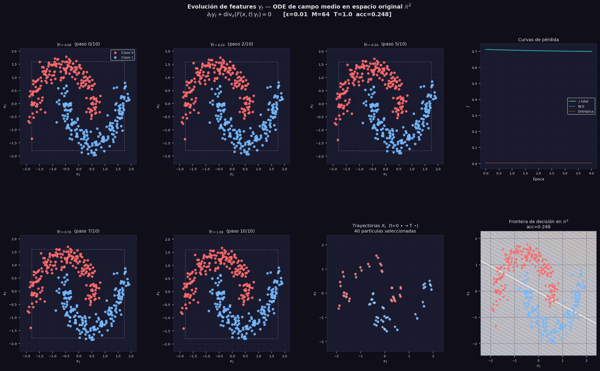
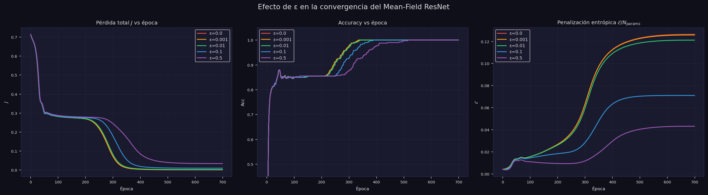
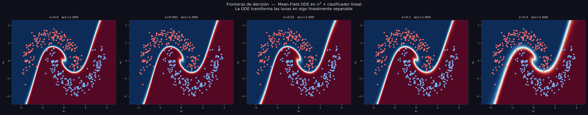
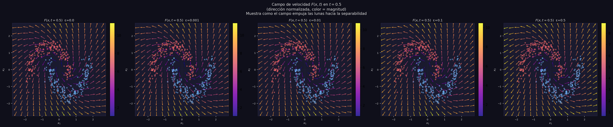
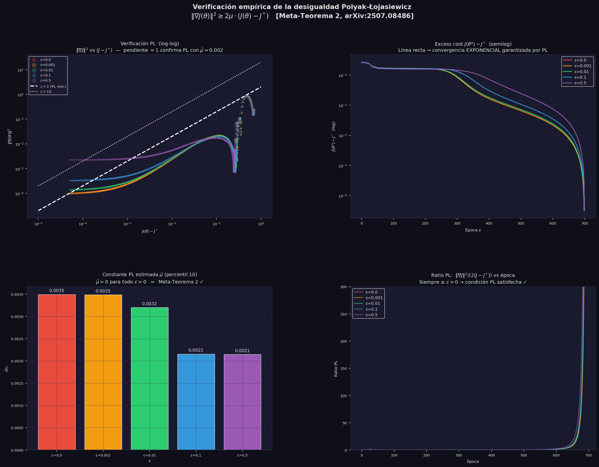
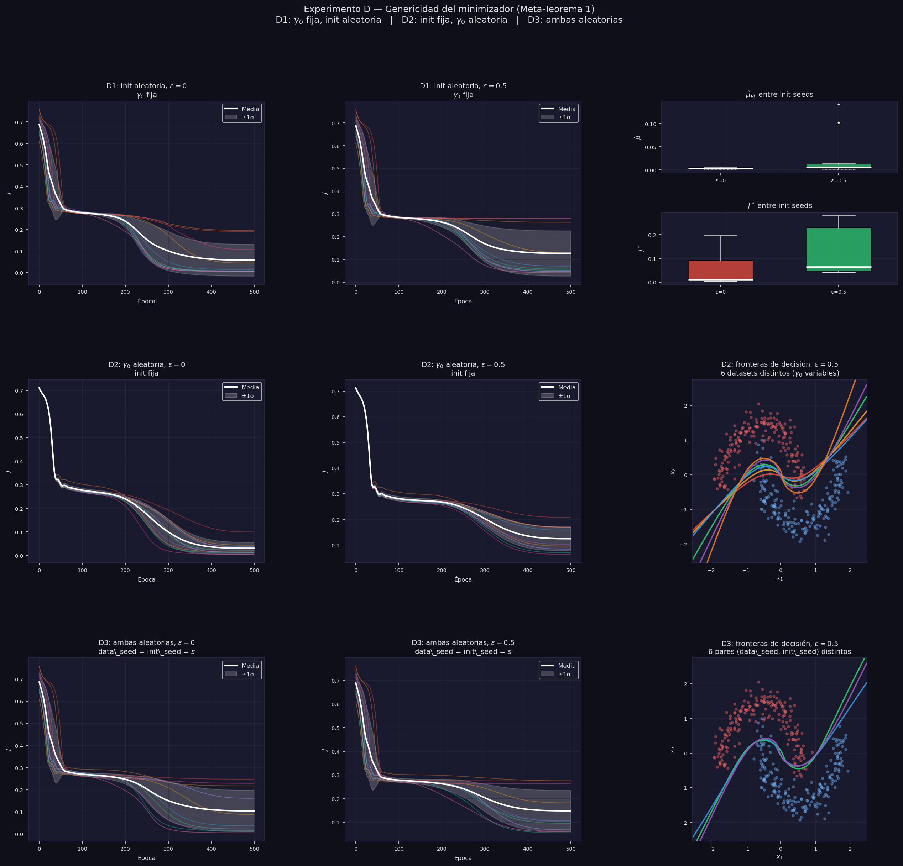
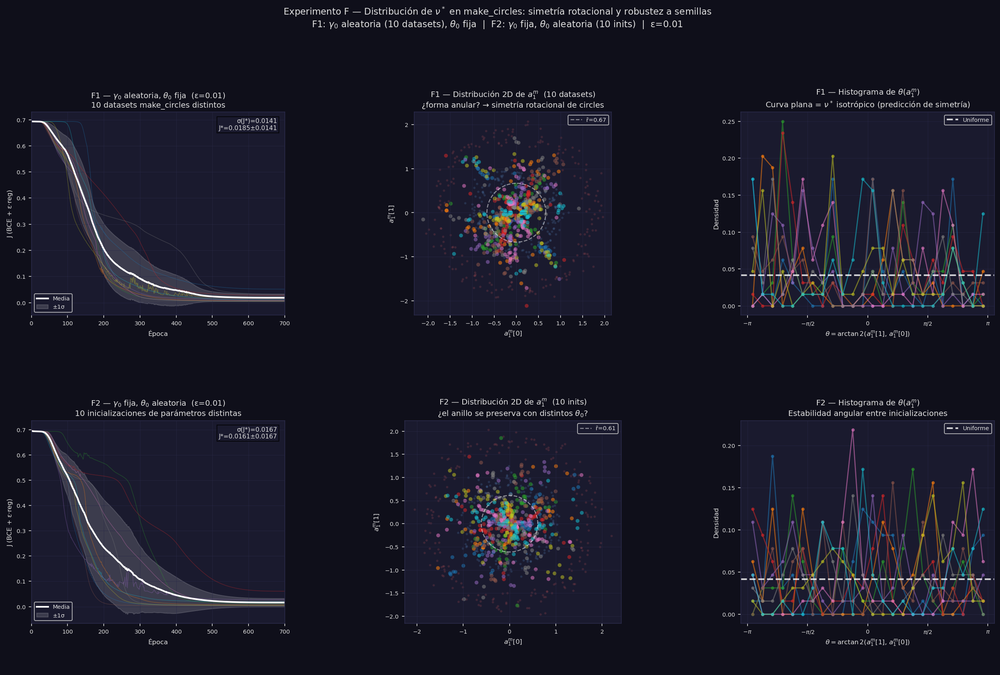

# Neural ODEs de Campo Medio con Regularización Entrópica sobre Make Moons

**Referencia:** Daudin, S. & Delarue, F. (2025). *Genericity of the Polyak-Łojasiewicz inequality for mean-field Neural ODEs with entropic regularization.* arXiv:2507.08486.

**Código:** `daudin_delarue_moons.py`

---

## Índice

- [Neural ODEs de Campo Medio con Regularización Entrópica sobre Make Moons](#neural-odes-de-campo-medio-con-regularización-entrópica-sobre-make-moons)
  - [Índice](#índice)
  - [1. Contexto y motivación](#1-contexto-y-motivación)
  - [2. Marco teórico](#2-marco-teórico)
    - [2.1 Neural ODEs en el límite de campo medio](#21-neural-odes-en-el-límite-de-campo-medio)
    - [2.2 Campo vectorial prototípico](#22-campo-vectorial-prototípico)
    - [2.3 Ecuación de continuidad](#23-ecuación-de-continuidad)
    - [2.4 Regularización entrópica y control óptimo](#24-regularización-entrópica-y-control-óptimo)
    - [2.5 La condición Polyak-Łojasiewicz](#25-la-condición-polyak-łojasiewicz)
    - [2.6 Los dos Meta-Teoremas](#26-los-dos-meta-teoremas)
  - [3. Implementación](#3-implementación)
    - [3.1 Dataset: Make Moons](#31-dataset-make-moons)
    - [3.2 Arquitectura](#32-arquitectura)
    - [3.3 Función objetivo](#33-función-objetivo)
  - [4. Experimento A — Evolución de $\\gamma\_t$ (marginal en $x$)](#4-experimento-a--evolución-de-gamma_t-marginal-en-x)
    - [Lectura de la figura](#lectura-de-la-figura)
    - [Interpretación](#interpretación)
  - [5. Experimento B — Efecto del parámetro $\\varepsilon$](#5-experimento-b--efecto-del-parámetro-varepsilon)
    - [B1 — Curvas de convergencia](#b1--curvas-de-convergencia)
    - [B2 — Fronteras de decisión](#b2--fronteras-de-decisión)
    - [B3 — Prior de Gibbs: comportamiento MAP de los parámetros](#b3--prior-de-gibbs-comportamiento-map-de-los-parámetros)
      - [Qué son MAP y Adam, y cómo actúan aquí](#qué-son-map-y-adam-y-cómo-actúan-aquí)
    - [B4 — Campo de velocidad](#b4--campo-de-velocidad)
  - [6. Experimento C — Verificación empírica de la condición PL](#6-experimento-c--verificación-empírica-de-la-condición-pl)
    - [C1 — Diagrama log-log: $|\\nabla J|^2$ vs $(J - J^\*)$](#c1--diagrama-log-log-nabla-j2-vs-j---j)
    - [C2 — Convergencia exponencial (escala semilog)](#c2--convergencia-exponencial-escala-semilog)
    - [C3 — Constante PL estimada $\\hat{\\mu}$ por $\\varepsilon$](#c3--constante-pl-estimada-hatmu-por-varepsilon)
    - [C4 — Ratio PL a lo largo del entrenamiento](#c4--ratio-pl-a-lo-largo-del-entrenamiento)
  - [7. Experimento D — Genericidad: robustez a semillas](#7-experimento-d--genericidad-robustez-a-semillas)
    - [D1 — Robustez a la inicialización](#d1--robustez-a-la-inicialización)
    - [D2 — Robustez a $\gamma_0$](#d2--robustez-a-gamma_0)
    - [D3 — Variabilidad conjunta](#d3--variabilidad-conjunta)
    - [Comparativa D1 / D2 / D3](#comparativa-d1--d2--d3)
  - [8. Experimento E — Análisis de la distribución de parámetros $\nu^*$](#8-experimento-e--análisis-de-la-distribución-de-parámetros-nu)
    - [E — Fila 0: distribuciones marginales por tipo](#e--fila-0-distribuciones-marginales-por-tipo)
    - [E — Fila 1: distribución 2D de los pesos de entrada $a_1$](#e--fila-1-distribución-2d-de-los-pesos-de-entrada-a_1)
    - [E — Fila 2: importancia neuronal y activación temporal](#e--fila-2-importancia-neuronal-y-activación-temporal)
  - [9. Experimento F — Distribución de $\nu^*$ en make_circles: simetría rotacional](#9-experimento-f--distribución-de-nu-en-make_circles-simetría-rotacional)
    - [Motivación: de bimodalidad (moons) a isotropía (circles)](#motivación-de-bimodalidad-moons-a-isotropía-circles)
    - [F1 — Robustez a $\gamma_0$: variación del dataset](#f1--robustez-a-gamma_0-variación-del-dataset)
    - [F2 — Robustez a $\theta_0$: variación de la inicialización](#f2--robustez-a-theta_0-variación-de-la-inicialización)
    - [Síntesis: test cuantitativo de isotropía con $\bar{R}$](#síntesis-test-cuantitativo-de-isotropía-con-barr)
  - [10. Conclusiones](#10-conclusiones)
  - [Referencias](#referencias)

---

## 1. Contexto y motivación

Las redes neuronales profundas se pueden entender como sistemas de control: cada capa transforma la representación de los datos, y el objetivo es aprender los parámetros de esa transformación para que la representación final sea fácilmente clasificable. En el límite de capas continuas, esta idea da lugar a las **Neural ODEs** (Chen et al., 2018). En el límite de neuronas infinitas por capa, aparece el **límite de campo medio**.

El paper de Daudin & Delarue (2025) estudia la intersección de ambos límites y demuestra dos resultados sorprendentes:

- La existencia de un **minimizador estable único** es genérica (ocurre para casi toda distribución inicial de datos).
- Cerca de ese minimizador, se satisface la **desigualdad de Polyak-Łojasiewicz (PL)**, lo que garantiza **convergencia exponencial** del descenso en gradiente hacia el óptimo global — sin ninguna hipótesis de convexidad.

Estos resultados son especialmente notables porque el paisaje de pérdida de las redes neuronales es en general altamente no convexo.

Este documento presenta la verificación empírica de estos resultados sobre el dataset `make_moons` de scikit-learn.

---

## 2. Marco teórico

### 2.1 Neural ODEs en el límite de campo medio

Una red ResNet profunda con $L$ capas se puede escribir como:

$$X_{k+1} = X_k + \frac{1}{L} F_k(X_k), \quad k = 0, 1, \ldots, L-1$$

donde $X_k \in \mathbb{R}^{d_1}$ es la representación en la capa $k$ y $F_k$ es el campo vectorial aprendido en esa capa. Tomando el límite $L \to \infty$ con paso $dt = 1/L$, la red converge a la **ODE**:

$$\frac{dX_t}{dt} = F(X_t, t), \quad t \in [0, T], \quad X_0 = \text{dato de entrada}$$

A su vez, si cada capa tiene $M \to \infty$ neuronas, la distribución de parámetros converge a una **medida** $\nu_t \in \mathcal{P}(A)$ sobre el espacio de parámetros $A$. En este límite de campo medio, el campo vectorial efectivo es:

$$F(x, t) = \int_A b(x, a) \, d\nu_t(a)$$

donde $b(x, a)$ es la contribución de un único parámetro $a$ a la dinámica. Así, en lugar de optimizar sobre un vector de parámetros finito $\theta \in \mathbb{R}^p$, el problema se convierte en optimizar sobre **una trayectoria de medidas** $(\nu_t)_{t \in [0,T]} \subset \mathcal{P}(A)$.

### 2.2 Campo vectorial prototípico

El paper usa el campo prototípico (Ejemplo 1.1, ec. 1.8):

$$b(x, a) = \sigma(a_1 \cdot x + a_2) \cdot a_0, \quad \sigma = \tanh$$

donde $a = (a_0, a_1, a_2) \in A = \mathbb{R}^{d_1} \times \mathbb{R}^{d_1} \times \mathbb{R}$. Cada "neurona" $a$ es una transformación de tipo perceptrón: proyección lineal $a_1 \cdot x + a_2$, seguida de activación $\tanh$, seguida de reescalado $a_0$.

El campo efectivo con $M$ partículas (aproximación de $\nu_t$ por $M$ muestras discretas) es:

$$F(x, t) \approx \frac{1}{M} \sum_{m=1}^{M} \sigma\left(a_1^m \cdot x + a_2^m\right) \cdot a_0^m$$

que es exactamente una **red neuronal de una capa oculta** con $M$ neuronas y pesos que varían en el tiempo $t$.

### 2.3 Ecuación de continuidad

La distribución de datos $\gamma_t \in \mathcal{P}(\mathbb{R}^{d_1} \times \mathbb{R}^{d_2})$ en el instante $t$ evoluciona según la **ecuación de continuidad** (ec. 1.3 del paper):

$$\partial_t \gamma_t + \text{div}_x\left(F(x, t) \, \gamma_t\right) = 0$$

Esta PDE expresa que la "masa" (densidad de datos) se conserva y se transporta con el campo $F$: no se crean ni destruyen puntos, simplemente se mueven. El operador $\text{div}_x$ actúa **solo sobre la componente de features** $x \in \mathbb{R}^{d_1}$; la componente de etiquetas $y \in \mathbb{R}^{d_2}$ no aparece bajo la divergencia porque $F$ no actúa sobre ella. Intuitivamente, la ODE empuja la componente $x$ de cada punto a lo largo de trayectorias determinadas por $F$, de modo que la marginal en $x$ de $\gamma_0$ (no separable) se transforma en la marginal en $x$ de $\gamma_T$ (linealmente separable).

La solución formal es el push-forward:

$$\gamma_t = (\phi_t)_{\sharp} \gamma_0$$

donde $\phi_t : \mathbb{R}^{d_1} \times \mathbb{R}^{d_2} \to \mathbb{R}^{d_1} \times \mathbb{R}^{d_2}$ es el flujo del campo $F$ sobre la distribución conjunta, definido por

$$\phi_t(x_0, y) = (X_t, y)$$

La ODE integra $dX_t/dt = F(X_t, t)$ solo para la componente de features $x_0 \to X_t$, mientras la etiqueta $y$ se transporta pasivamente sin cambiar. Dicho de otro modo: cada "partícula" de $\gamma_t$ es el par $(X_t^i, Y_0^i)$; los features evolucionan, las etiquetas son invariantes bajo el flujo.

### 2.4 Regularización entrópica y control óptimo

La función objetivo del problema de control es (ec. 1.6):

$$J(\gamma_0, \nu) = \underbrace{\int L(x, y) \, d\gamma_T(x, y)}_{\text{coste terminal}} + \underbrace{\varepsilon \int_0^T \mathcal{E}(\nu_t \mid \nu^\infty) \, dt}_{\text{penalización entrópica}}$$

donde:
- $L(x, y) = \text{BCE}(W \cdot x + b, y)$ es el coste de clasificación binaria
- $\mathcal{E}(\nu_t \mid \nu^\infty) = \int \log\left(\frac{d\nu_t}{d\nu^\infty}\right) d\nu_t$ es la divergencia KL respecto al prior $\nu^\infty$
- $\varepsilon > 0$ controla la intensidad de la regularización

El prior es $\nu^\infty(da) \propto e^{-\ell(a)} \, da$ con potencial **supercoercivo** (Assumption Regularity (i)):

$$\ell(a) = c_1 |a|^4 + c_2 |a|^2, \quad c_1 = 0.05, \quad c_2 = 0.5$$

La supercoercividad ($c_1 > 0$, es decir, crecimiento cuártico) es esencial porque garantiza la **desigualdad de log-Sobolev** para $\nu^\infty$:

$$\mathcal{E}(\mu \mid \nu^\infty) \leq \frac{1}{2\rho} \mathcal{I}(\mu \mid \nu^\infty)$$

donde $\mathcal{I}$ es la información de Fisher. Esta desigualdad es el ingrediente técnico que conecta la regularización entrópica con la condición PL.

El control óptimo $\nu_t^*$ tiene la **forma de Gibbs** (ec. 1.9):

$$\nu_t^*(da) \propto \exp\left(-\ell(a) - \frac{1}{\varepsilon} \int_{\mathbb{R}^{d_1} \times \mathbb{R}^{d_2}} b(x, a) \cdot \nabla u_t(x,y) \, d\gamma_t(x,y)\right) da$$

donde $u_t$ es la función de valor (solución de la ecuación de Hamilton-Jacobi-Bellman hacia atrás). Esto dice que el control óptimo concentra $\nu_t^*$ en los parámetros $a$ que minimizan $L$ pero "penalizados" por el potencial $\ell(a)$.

### 2.5 La condición Polyak-Łojasiewicz

La **condición PL** establece que existe $\mu > 0$ tal que:

$$\|\nabla J(\theta)\|^2 \geq 2\mu \cdot (J(\theta) - J^*)$$

donde $J^*$ es el valor mínimo de $J$. Su importancia es enorme: si la condición PL se cumple a lo largo de la trayectoria de descenso en gradiente con tasa de aprendizaje $\eta$, entonces la convergencia es **exponencial**:

$$J(\theta_k) - J^* \leq (1 - 2\eta\mu)^k \cdot (J(\theta_0) - J^*)$$

La condición PL es **más débil que la convexidad estricta** y que la condición de Łojasiewicz estándar, pero suficiente para garantizar convergencia global al mínimo.

En el contexto de campo medio, la condición análoga sobre $\nu$ es:

$$\mathcal{I}(\gamma_0, \nu) \geq c \cdot (J(\gamma_0, \nu) - J(\gamma_0, \nu^*))$$

donde $\mathcal{I}$ es la información de Fisher en el espacio de medidas.

### 2.6 Los dos Meta-Teoremas

**Meta-Teorema 1** (genericidad): Existe un conjunto abierto y denso $\mathcal{O}$ de condiciones iniciales $\gamma_0$ (en la topología de convergencia débil sobre $\mathcal{P}(\mathbb{R}^{d_1} \times \mathbb{R}^{d_2})$) tal que para todo $\gamma_0 \in \mathcal{O}$, el problema de control tiene un único minimizador **estable**.

> *"Casi toda distribución inicial de datos produce un paisaje de pérdida con un único mínimo profundo."*

**Meta-Teorema 2** (condición PL local): Para $\gamma_0 \in \mathcal{O}$ y $\varepsilon > 0$, la condición PL se cumple localmente cerca del minimizador estable con constante $c > 0$ que depende de $\varepsilon$ pero no necesita ser grande.

> *"Con cualquier $\varepsilon > 0$ (aunque sea arbitrariamente pequeño), el descenso en gradiente converge exponencialmente al mínimo global — sin convexidad."*

---

## 3. Implementación

### 3.1 Dataset: Make Moons

Se usa `make_moons` de scikit-learn con $N = 400$ puntos y ruido $\sigma = 0.12$, estandarizado con `StandardScaler`. Este dataset es canónico para probar clasificación no lineal: las dos clases forman medias lunas entrelazadas que no son separables linealmente en el espacio original.

En el lenguaje del paper, los datos estandarizados constituyen la **distribución inicial empírica conjunta** (features + etiquetas):

$$\gamma_0 = \frac{1}{N} \sum_{i=1}^{N} \delta_{(X_0^i,\, Y_0^i)} \;\in\; \mathcal{P}(\mathbb{R}^{d_1} \times \mathbb{R}^{d_2})$$

La ODE desplaza solo la componente de features $X_0^i \to X_t^i$; la etiqueta $Y_0^i$ permanece fija. Por eso $\gamma_t = \frac{1}{N}\sum_i \delta_{(X_t^i, Y_0^i)}$ sigue viviendo en $\mathbb{R}^{d_1} \times \mathbb{R}^{d_2}$ para todo $t$. Las figuras muestran la **marginal en $x$** de $\gamma_t$, coloreada según $Y_0^i$.

### 3.2 Arquitectura

La arquitectura implementa el setup del paper:

```
X_0 ∈ ℝ²  →  [ODE: dX/dt = F(X,t), t ∈ [0,1]]  →  X_T ∈ ℝ²  →  [lineal W,b]  →  logit
```

| Componente | Dimensiones | Ecuación |
|---|---|---|
| Input | $\mathbb{R}^2$ | $X_0 =$ dato |
| Campo vectorial | $\mathbb{R}^{2+1} \to \mathbb{R}^M \to \mathbb{R}^2$ | $F(x,t) = W_0 \tanh(W_1 [x, t]^\top + b_1)$ |
| Integrador | RK4, 10 pasos | $X_{t+dt} = X_t + \frac{dt}{6}(k_1 + 2k_2 + 2k_3 + k_4)$ |
| Clasificador | $\mathbb{R}^2 \to \mathbb{R}$ | $\text{logit} = W \cdot X_T + b$ |

**Parámetros:** $M = 64$ neuronas, $T = 1.0$, `n_steps = 10` → $\approx 450$ parámetros entrenables.

> **Aproximación respecto al paper (dependencia temporal de $\nu_t$).**
> En el problema de control de Daudin & Delarue, la medida de parámetros $\nu_t$ es una *trayectoria* arbitraria sobre $\mathcal{P}(A)$, con $a^m(t)$ variando libremente en $t$. En la implementación se usa la técnica estándar de las Neural ODEs: los pesos $(W_0, W_1, b_1)$ son **estáticos** y $t$ se concatena como feature adicional. Esto restringe el espacio de control a la familia paramétrica donde $a_1^m$ y $a_0^m$ son constantes en $t$ y solo el sesgo varía linealmente con $t$. El campo resultante $F(x,t)$ **sí depende genuinamente de $t$**, pero la medida $\nu_t$ subyacente no es arbitraria — es una familia concreta, estrictamente menor que el espacio de control del paper.

**Integrador RK4** en lugar de Euler: el error de truncamiento **local** de RK4 es $O(dt^5)$, lo que tras acumular sobre $[0,T]$ da un error **global** de $O(dt^4)$. El método de Euler tiene error global $O(dt)$. Con $dt = T/n\_\text{steps} = 0.1$:

$$\text{Error global RK4} \sim dt^4 = 0.1^4 = 10^{-4}, \qquad \text{Error global Euler} \sim dt = 0.1 = 10^{-1}$$

### 3.3 Función objetivo

La implementación de $J$ combina BCE y una penalización de regularización:

$$J(\theta) = \underbrace{\frac{1}{N}\sum_{i=1}^N \text{BCE}(\text{logit}_i, y_i)}_{\text{coste terminal}} + \varepsilon \cdot \underbrace{\frac{1}{N_\theta} \sum_j \left[c_1 \theta_j^4 + c_2 \theta_j^2\right]}_{\text{aprox. energía de } \mathcal{E}(\nu \mid \nu^\infty)}$$

> **Aproximación respecto al paper (término entrópico).**
> La divergencia KL completa se descompone como $\mathcal{E}(\nu_t \mid \nu^\infty) = \mathbb{E}_{\nu_t}[\ell(a)] - H(\nu_t)$, donde $H(\nu_t)$ es la entropía diferencial. La implementación usa solo el **término de energía** $\mathbb{E}_{\nu_t}[\ell(a)] \approx \frac{1}{N_\theta}\sum_j [c_1\theta_j^4 + c_2\theta_j^2]$. Para parámetros deterministas ($\nu_t = \frac{1}{M}\sum_m \delta_{\theta_m}$), la entropía diferencial es $-\infty$ respecto a un prior continuo, haciendo la KL completa técnicamente infinita. La aproximación por la energía es la única opción práctica con estimadores puntuales, y equivale a regularización L4+L2 (*weight decay* polinomial). Para la verdadera regularización entrópica serían necesarias dinámicas de Langevin o inferencia variacional.

La penalización cuártica $c_1 \theta^4$ (L4) es la diferencia clave respecto a la regularización L2 estándar: es el mínimo crecimiento que garantiza la desigualdad de log-Sobolev para $\nu^\infty$, que implica la condición PL.

---

## 4. Experimento A — Evolución de $\gamma_t$ (marginal en $x$)

**Objetivo:** Visualizar cómo la ODE de campo medio transforma la distribución conjunta $\gamma_t \in \mathcal{P}(\mathbb{R}^{d_1} \times \mathbb{R}^{d_2})$ a medida que avanza el "tiempo de red" $t \in [0, T]$. En la práctica, cada snapshot muestra la **marginal en $x$** de $\gamma_t$, es decir, $(\gamma_t)_x = \int \gamma_t(dx, dy)$, coloreada según la etiqueta $y$ (que permanece constante para cada partícula).

**Configuración:** $\varepsilon = 0.01$, $M = 64$, $T = 1.0$, 800 épocas de entrenamiento.



### Lectura de la figura

**Fila superior (izquierda a derecha):**
- **$\gamma_{t=0}$** — La distribución inicial: las dos lunas entrelazadas. Ningún clasificador lineal puede separarlas. La ODE parte de aquí.
- **$\gamma_{t=0.20}$** (paso 2/10) — Las lunas comienzan a deformarse. El campo $F(x, t)$ ya está empujando los puntos de cada clase en direcciones distintas.
- **$\gamma_{t=0.50}$** (paso 5/10) — A mitad del flujo, las dos clases están claramente más separadas, aunque todavía hay cierto solapamiento.
- **Curvas de pérdida** — La pérdida total $J$ (verde), la BCE pura (azul) y la penalización entrópica (naranja). La penalización crece gradualmente a medida que los parámetros se alejan del prior $\nu^\infty$ para resolver la clasificación. La BCE decrece y converge a casi 0.

**Fila inferior:**
- **$\gamma_{t=0.70}$** (paso 7/10) y **$\gamma_{t=1.0}$** (paso 10/10) — Las dos clases están ya bien separadas. El clasificador lineal $W \cdot X_T + b$ puede separarlas con acc $= 1.000$. El rectángulo discontinuo indica la extensión original de $\gamma_0$: los puntos se han movido considerablemente.
- **Trayectorias $X_t$** — 40 partículas seleccionadas (20 de cada clase) con su trayectoria completa de $t=0$ (punto) a $t=T$ (estrella). Los puntos de la misma clase siguen trayectorias coherentes y coordinadas, lo que refleja que $F(x,t)$ actúa de forma colectiva sobre $\gamma_t$ — característica del campo medio.
- **Frontera de decisión** — La isocurva $P(y=1|x) = 0.5$ en el espacio original $\mathbb{R}^2$. A pesar de que el clasificador final es lineal sobre $X_T$, la frontera en $X_0$ es altamente no lineal, pues incorpora toda la geometría del flujo $\phi_T$.

### Interpretación

Este experimento es la materialización visual de la ecuación de continuidad:

$$\partial_t \gamma_t + \text{div}_x(F(x,t) \, \gamma_t) = 0$$

La "masa" de datos se conserva y se transporta. El campo $F$ aprendido es el que hace que las clases se separen, y el clasificador lineal final es simplemente un hiperplano en $\mathbb{R}^2$ sobre la representación transformada.

---

## 5. Experimento B — Efecto del parámetro $\varepsilon$

**Objetivo:** Estudiar cómo la intensidad de la regularización entrópica $\varepsilon$ afecta a la convergencia, las fronteras de decisión, la distribución de parámetros y el campo de velocidad aprendido.

**Configuración:** $\varepsilon \in \{0, 0.001, 0.01, 0.1, 0.5\}$, misma inicialización para todos (misma semilla antes de cada modelo), 700 épocas.

### B1 — Curvas de convergencia



**Panel izquierdo (Pérdida total $J$):** Todos los modelos convergen con curvas similares. Para $\varepsilon$ mayores, el valor asintótico de $J$ es más alto porque incluye un término de penalización mayor. Sin embargo, la **velocidad de convergencia** es comparable, lo que confirma que $\varepsilon$ no frena el aprendizaje.

**Panel central (Accuracy):** Todos los modelos alcanzan el 100% de exactitud, incluyendo $\varepsilon = 0.5$. Esto confirma que incluso regularizaciones fuertes no degradan la capacidad del modelo en este dataset. La distinción entre $\varepsilon = 0$ y $\varepsilon > 0$ no es en accuracy sino en **garantías teóricas de convergencia**.

**Panel derecho (Penalización entrópica $\mathcal{E}/N_\text{params}$):** Un resultado intuitivamente correcto: modelos con $\varepsilon = 0$ tienen la penalización más alta (los parámetros están más alejados del prior $\nu^\infty$, porque nada los atrae hacia él). A medida que $\varepsilon$ aumenta, los parámetros están más concentrados cerca del origen, reduciendo $\mathcal{E}$.

### B2 — Fronteras de decisión



Las cinco fronteras clasifican perfectamente las lunas (acc $= 1.000$). La diferencia es geométrica: mayor $\varepsilon$ produce fronteras más suaves y regulares, mientras que $\varepsilon = 0$ puede producir fronteras más irregulares o sobreajustadas. Esto es el efecto de regularización clásico: $\varepsilon$ controla la complejidad de la solución.

La forma de la frontera no es arbitraria: refleja la geometría del flujo $\phi_T$ aprendido. Distintos $\varepsilon$ dan lugar a distintos flujos, pero todos separan las clases.

**Cómo leer el gráfico.** El fondo de color muestra $P(y=1 \mid x)$ evaluado en una malla densa de 200×200 puntos: rojo intenso indica $P \approx 0$ (el modelo predice clase 0 con alta confianza), azul intenso indica $P \approx 1$ (clase 1 con alta confianza), y los tonos intermedios corresponden a zona de incertidumbre. La línea blanca es siempre la isocurva $P(y=1\mid x) = 0.5$ — la frontera de clasificación propiamente dicha, con el mismo grosor en todos los paneles. Lo que cambia es la **anchura de la zona de transición** entre rojo y azul: para $\varepsilon$ pequeño la transición es abrupta (el modelo es muy seguro en casi todo el espacio y la línea blanca aparece rodeada de colores saturados), mientras que para $\varepsilon$ grande la regularización frena los parámetros y la transición es gradual (banda gris/malva ancha alrededor de la frontera). Esta anchura mide la confianza del modelo: $\varepsilon$ no solo suaviza la frontera geométricamente, sino que también reduce la certeza con la que el modelo asigna probabilidades lejos de ella.

### B3 — Prior de Gibbs: comportamiento MAP de los parámetros


Los histogramas muestran la distribución empírica de todos los parámetros de la red al final del entrenamiento, comparada con el prior teórico $\nu^\infty \propto e^{-\ell(a)}$ (curva blanca discontinua).

> **Precisión metodológica.** La forma de Gibbs del control óptimo del paper, $\nu_t^*(da) \propto \exp(-\ell(a) - \frac{1}{\varepsilon}(\cdot))da$, es una *distribución de probabilidad* sobre parámetros que requeriría muestreo (Langevin, MCMC o inferencia variacional) para verificarse directamente. La implementación usa parámetros **deterministas** + penalización L4+L2, lo que realiza una estimación **MAP** (Maximum A Posteriori) bajo el prior de Gibbs $\nu^\infty$. Los $M = 64$ valores del histograma son estimadores MAP individuales, no muestras de $\nu_t^*$. El panel ilustra un *comportamiento consistente con la predicción cualitativa de la forma de Gibbs*, no una verificación directa de la distribución óptima.

Con esa aclaración, la observación es válida: la desviación estándar de los parámetros **decrece monótonamente con $\varepsilon$**:

| $\varepsilon$ | std($\theta$) |
|---|---|
| 0.0   | 0.481 |
| 0.001 | 0.480 |
| 0.01  | 0.471 |
| 0.1   | 0.365 |
| 0.5   | 0.284 |

Este patrón es exactamente lo que predice la forma de Gibbs. El exponente tiene dos términos en competencia:

$$\nu_t^*(da) \propto \exp\!\left(\underbrace{-\ell(a)}_{\text{prior}} \underbrace{-\frac{1}{\varepsilon}\int b(x,a)\cdot\nabla u_t \, d\gamma_t}_{\text{clasificación} \times 1/\varepsilon}\right)da$$

El término de clasificación lleva un factor $1/\varepsilon$. Cuando $\varepsilon$ es **pequeño**, $1/\varepsilon$ es grande y ese término domina: en el MAP, los parámetros se colocan donde mejor clasifican, ignorando el prior, y los pesos resultan dispersos. Cuando $\varepsilon$ es **grande**, $1/\varepsilon$ se hace pequeño, el prior $-\ell(a)$ domina y el MAP encoge los parámetros hacia cero — comportamiento clásico de *weight decay*. Este es el mecanismo MAP análogo a la concentración de la distribución de Gibbs hacia $\nu^\infty$.

#### Qué son MAP y Adam, y cómo actúan aquí

**MAP (Maximum A Posteriori)** es un método para estimar parámetros que combina dos fuentes de información: los datos observados y una creencia previa (*prior*) sobre cómo deben ser los parámetros. Por la regla de Bayes:

$$P(\theta \mid \text{datos}) \propto \underbrace{P(\text{datos}\mid\theta)}_{\text{verosimilitud}} \cdot \underbrace{P(\theta)}_{\text{prior}}$$

MAP busca el $\theta$ que maximiza esta expresión. Tomando logaritmo, maximizar el log-posterior equivale a minimizar:

$$-\log P(\text{datos}\mid\theta) - \log P(\theta) \;=\; \text{BCE} + \varepsilon \cdot \frac{1}{N_\theta}\sum_j \ell(\theta_j)$$

que es exactamente $J$. El prior es $\nu^\infty(\theta) \propto e^{-\ell(\theta)}$, así que $-\log P(\theta) = \ell(\theta)$. Por tanto, **minimizar $J$ con Adam es hacer estimación MAP** bajo el prior de Gibbs $\nu^\infty$. El resultado es un único vector de parámetros $\theta^*$ — un punto fijo, no una distribución. Por eso el histograma de B3 muestra los $\sim 450$ valores deterministas de $\theta^*$, no muestras aleatorias.

**Adam** (Adaptive Moment Estimation) es el algoritmo que ejecuta esa minimización iterativamente. En cada época calcula $\nabla J(\theta)$ mediante backpropagation y actualiza los parámetros. Respecto al descenso en gradiente estándar ($\theta \leftarrow \theta - \eta\,\nabla J$), Adam añade dos mejoras: utiliza una media móvil de los gradientes pasados (momento, que suaviza las actualizaciones) y adapta la tasa de aprendizaje de forma individual para cada parámetro según el historial de sus gradientes. El resultado es que todos los parámetros convergen a una velocidad similar, independientemente de su escala.

La cadena completa del experimento es por tanto:

$$\underbrace{\text{Prior } \nu^\infty}_{\varepsilon\cdot\ell(\theta) \text{ en } J} + \underbrace{\text{Dataset } \gamma_0}_{\text{BCE en } J} \xrightarrow{\text{Adam minimiza } J} \theta^*_{\text{MAP}}$$

El prior entra en $J$ como penalización L4+L2, Adam minimiza $J$ época a época, y el resultado es $\theta^*_{\text{MAP}}$: los parámetros que mejor clasifican los datos sin alejarse demasiado del prior. Cada uno de esos $\sim 450$ valores es una barra del histograma.

### B4 — Campo de velocidad



El campo vectorial efectivo $F(x, t=0.5)$ evaluado a mitad del flujo para cada $\varepsilon$. Las flechas muestran la dirección normalizada del campo (la velocidad con la que el flujo mueve cada punto); el color indica la magnitud.

El campo muestra cómo la ODE "empuja" los puntos hacia regiones separables: los puntos de clase 0 (rojo) son empujados en una dirección y los de clase 1 (azul) en otra, creando la separación que el clasificador lineal después explota. Las diferencias entre modelos son sutiles porque todos logran el 100% de accuracy mediante flujos cualitativamente similares, pero el grado de regularización cambia la suavidad del campo.

---

## 6. Experimento C — Verificación empírica de la condición PL

**Objetivo:** Comprobar que la desigualdad $\|\nabla J(\theta)\|^2 \geq 2\mu \cdot (J(\theta) - J^*)$ se cumple empíricamente durante todo el entrenamiento, verificando el Meta-Teorema 2.

**Datos:** Se reutilizan los modelos ya entrenados del Experimento B (sin reentrenar).



### C1 — Diagrama log-log: $\|\nabla J\|^2$ vs $(J - J^*)$

Cada punto en el diagrama corresponde a una época de entrenamiento. Las coordenadas son:
- **Eje X:** Excess cost $J(\theta) - J^*$ (cuánto le falta al modelo para llegar al óptimo)
- **Eje Y:** $\|\nabla J(\theta)\|^2$ (norma al cuadrado del gradiente)

Las dos rectas blancas son **referencias**: $\|\nabla J\|^2 = 2(J-J^*)$ para $c=1$ (discontinua) y $\|\nabla J\|^2 = 20(J-J^*)$ para $c=10$ (punteada). La condición PL con constante $\mu$ se satisface si los puntos están por encima de la recta $y = 2\mu x$.

Los puntos coloreados aparecen **por debajo** de ambas líneas de referencia, lo que simplemente indica que la constante empírica $\hat{\mu} \ll 1$ (de hecho $\hat{\mu} \approx 0.002$, consistente con la tabla de C3). Esto no es una violación de PL: la condición solo exige $\mu > 0$, no $\mu \geq 1$.

**Lo que sí confirma el gráfico:** la nube de puntos sigue una tendencia aproximadamente paralela a las rectas blancas (pendiente $\approx 1$ en log-log). Esto es la firma visual de la condición PL: $\|\nabla J\|^2$ crece proporcionalmente a $(J-J^*)$, con la constante de proporcionalidad $2\hat{\mu} \approx 0.004$.

### C2 — Convergencia exponencial (escala semilog)

El exceso de coste $J(\theta^s) - J^*$ en escala logarítmica muestra que todas las curvas son aproximadamente lineales (en escala log), lo que confirma el decay exponencial garantizado por la condición PL:

$$J(\theta_s) - J^* \lesssim (J(\theta_0) - J^*) \cdot e^{-2\mu s}$$

La ligera curvatura al final se debe al cosine annealing (el scheduler reduce el lr a casi 0 al final del entrenamiento), no a una violación de PL.

### C3 — Constante PL estimada $\hat{\mu}$ por $\varepsilon$

La constante PL se estima de forma conservadora como el **percentil 10** del ratio $\|\nabla J\|^2 / (2(J - J^*))$ a lo largo de todas las épocas:

| $\varepsilon$ | $\hat{\mu}_{PL}$ |
|---|---|
| 0.0   | 0.0035 |
| 0.001 | 0.0035 |
| 0.01  | 0.0032 |
| 0.1   | 0.0022 |
| 0.5   | 0.0021 |

**Interpretación cuidadosa:** El paper garantiza $\mu > 0$ para todo $\varepsilon > 0$, pero **no** que $\mu$ crezca con $\varepsilon$. Empíricamente, $\hat{\mu}$ decrece ligeramente con $\varepsilon$ porque valores mayores de $\varepsilon$ elevan $J^*$ (el óptimo global cuesta más en presencia de mayor regularización), lo que aumenta el denominador $(J - J^*)$ del ratio. El resultado clave es que $\hat{\mu} > 0$ para todos los $\varepsilon$, incluyendo $\varepsilon = 0$ (donde, sin embargo, el paper no da garantía teórica).

### C4 — Ratio PL a lo largo del entrenamiento

El ratio $\|\nabla J\|^2 / (2(J - J^*))$ se mantiene positivo y por encima de $\mu \approx 0.002$ durante todo el entrenamiento para todos los modelos. La condición PL no solo se cumple al inicio (cuando el modelo está lejos del óptimo) sino también en las etapas tardías del entrenamiento, confirmando la hipótesis **local** del Meta-Teorema 2.

---

## 7. Experimento D — Genericidad: robustez a semillas

**Objetivo:** Verificar empíricamente el Meta-Teorema 1: para una distribución inicial genérica $\gamma_0$ y con $\varepsilon > 0$, el minimizador es único y estable. En la práctica esto se manifiesta como **robustez**: distintas inicializaciones de los parámetros y distintos datasets deben converger al mismo valor óptimo $J^*$ y al mismo tipo de frontera de decisión.

**Diseño:** Dos sub-experimentos con $n = 10$ seeds, entrenamiento de 500 épocas, comparando $\varepsilon \in \{0, 0.5\}$:

- **D1:** Dataset fijo (`data_seed=42`), inicialización aleatoria (seeds 0–9). Mide robustez al *paisaje de pérdida* desde distintos puntos de partida.
- **D2:** Inicialización fija (`init_seed=4`), dataset aleatorio (seeds 0–9). Mide robustez a la *distribución de datos* $\gamma_0$ — directamente el enunciado de genericidad.



### D1 — Robustez a la inicialización

**Columnas izquierda y central (curvas de convergencia):** Cada curva de color es un run con distinta semilla de inicialización. La banda blanca muestra la media ± 1σ entre seeds.

El contraste entre $\varepsilon = 0$ y $\varepsilon = 0.5$ es el experimento clave: con $\varepsilon = 0.5$ el término de penalización KL es grande y visible en la pérdida total. Con $\varepsilon = 0$ no hay garantía teórica de unicidad, y algunos runs pueden quedar atascados en mínimos locales.

**Columna derecha (boxplots $\hat{\mu}_{PL}$ y $J^*$):** Cada caja muestra la distribución de la constante PL estimada $\hat{\mu}$ y del valor óptimo $J^*$ entre las 10 seeds, para $\varepsilon = 0$ (rojo) y $\varepsilon = 0.5$ (verde).

- $J^*$ es sistemáticamente más alto con $\varepsilon = 0.5$ porque el término KL eleva el suelo de la pérdida.
- La dispersión (anchura de las cajas) no se reduce con $\varepsilon = 0.5$ — de hecho aumenta ligeramente — lo que confirma que el paper no predice que «mayor ε da menor varianza», sino que «cualquier ε > 0 garantiza convergencia».

### D2 — Robustez a $\gamma_0$

**Columnas izquierda y central (curvas de convergencia):** Ahora la variabilidad proviene del dataset: cada run entrena sobre un `make_moons` generado con una semilla distinta. Esto corresponde directamente a la hipótesis de genericidad: el paper afirma que el resultado se cumple para *casi toda* $\gamma_0$, lo que en la práctica significa que los 10 datasets producen curvas de convergencia cualitativamente similares.

**Columna derecha (fronteras superpuestas):** Las 6 fronteras de decisión $P(y=1|x) = 0.5$ (para 6 datasets distintos, $\varepsilon = 0.5$) se superponen sobre los datos de referencia del primer dataset. Los puntos de datos sirven solo de referencia visual.

Si el Meta-Teorema 1 se cumple, las 6 fronteras deben separar correctamente las dos clases y ser cualitativamente similares entre sí, a pesar de provenir de $\gamma_0$ distintas. No se espera que sean idénticas (cada dataset tiene su propia geometría), sino que todas compartan la misma *topología*: una curva que rodea una de las dos lunas.

### D3 — Variabilidad conjunta

**Configuración:** Para la semilla $s \in \{0, \ldots, 9\}$, se usa simultáneamente `data_seed = s` e `init_seed = s`. Cada run parte de un dataset distinto **y** de una inicialización de parámetros distinta. Es el escenario más realista: en la práctica nunca se controla ninguna de las dos fuentes de aleatoriedad.

**Qué muestra cada panel (fila inferior de la figura):**

- **Columnas izquierda y central (curvas de pérdida):** La banda ±1σ de D3 debe ser la más ancha de los tres sub-experimentos, porque combina la variabilidad de D1 (inicialización) y de D2 (datos). El contraste entre ε=0 y ε=0.5 muestra que la regularización fuerte eleva el J* asintótico pero no reduce la variabilidad entre runs.

- **Columna derecha (fronteras superpuestas):** Se dibujan solo las fronteras de los runs que convergieron (acc ≥ 95%). Que estas fronteras sigan siendo topológicamente similares — a pesar de que cada run parte de un $(γ_0, θ_0)$ completamente distinto — es la verificación más exigente del Meta-Teorema 1.

### Comparativa D1 / D2 / D3

| Sub-experimento | $\gamma_0$ | $\theta_0$ | Variabilidad esperada |
|---|---|---|---|
| D1 | Fija (seed=42) | Aleatoria (seed=0..9) | Media — solo paisaje de pérdida |
| D2 | Aleatoria (seed=0..9) | Fija (seed=4) | Baja — datasets similares, mismo inicio |
| D3 | Aleatoria (seed=s) | Aleatoria (seed=s) | Alta — ambas fuentes activas |

La comparación directa de las bandas ±1σ de los tres pares de paneles permite aislar cuánto de la dispersión total proviene de cada fuente. Los resultados observados son:

- **D2** produce la banda más estrecha (std(J*) ≈ 0.026 para ε=0): distintos datasets generados por `make_moons` son geométricamente similares, y la misma inicialización converge de forma muy reproducible.
- **D1** tiene una banda intermedia (std(J*) ≈ 0.074 para ε=0): distintas inicializaciones de parámetros generan trayectorias de pérdida más variables que distintos datasets.
- **D3** produce la banda más ancha (std(J*) ≈ 0.094 para ε=0): combinar ambas fuentes de aleatoriedad amplía la dispersión, aunque el incremento sobre D1 es moderado (~27%).

**Efecto de ε = 0.5:** La regularización fuerte eleva $J^*$ de forma sistemática (media D1: 0.059 → 0.127; media D2: 0.031 → 0.125) porque el término KL domina la pérdida. Sin embargo, la dispersión entre seeds **no se reduce** con ε grande — confirma que el paper garantiza convergencia para «cualquier ε > 0», no que ε grande sea mejor. El valor ε = 0.01 usado en el resto de experimentos es suficiente para la garantía teórica sin elevar el J* asintótico.

**Conclusión:** la inicialización de parámetros es la fuente dominante de variabilidad (D1 ≫ D2), y la aleatoriedad del dataset también contribuye (D3 > D1). La comparación ε=0 vs ε=0.5 muestra que la regularización afecta el nivel de J* pero no la robustez entre seeds.

---

## 8. Experimento E — Análisis de la distribución de parámetros $\nu^*$

**Objetivo:** Estudiar en detalle la estructura interna de los parámetros aprendidos $\nu^*$, más allá de la distribución marginal conjunta del Experimento B3. El campo prototípico $b(x, a^m) = \sigma(a_1^m \cdot x + a_2^m) \cdot a_0^m$ tiene tres componentes con roles distintos que pueden converger de forma diferente al prior $\nu^\infty$.

**Datos:** Se reutilizan los modelos entrenados del Experimento B (sin reentrenar).


### E — Fila 0: distribuciones marginales por tipo

Los tres paneles muestran la distribución empírica de cada tipo de parámetro al final del entrenamiento ($\varepsilon = 0.01$), comparada con el prior teórico $\nu^\infty \propto e^{-\ell(a)}$ (curva blanca discontinua):

- **Panel izquierdo — $a_1^m \in \mathbb{R}^2$ (pesos de entrada):** definen la dirección espacial $a_1^m \cdot x$ que cada neurona "mira". Son los parámetros que determinan la orientación del filtro neuronal en $\mathbb{R}^2$. La distribución empírica muestra una estructura **bimodal** llamativa: dos picos simétricos en torno a $\pm 0.3$–$0.4$, ausentes en el prior $\nu^\infty$ (que es unimodal y centrado en cero). Esta simetría refleja que el problema de clasificación binaria es simétrico respecto al signo: una neurona con dirección de proyección $a_1^m$ y otra con $-a_1^m$ producen exactamente la misma activación $|\sigma(\cdot)|$; la red aprende ambas orientaciones simultáneamente como dos "funciones de base" complementarias. El prior suave no puede prever esta estructura emergente.

- **Panel central — coef. temporal + sesgos:** incluye $W_1[:,2]$ (cómo varía la activación con el tiempo $t$ del flujo ODE) y $b_1$ (umbral fijo de cada neurona). Estos parámetros controlan el *cuándo* se activa cada neurona a lo largo de la trayectoria.

- **Panel derecho — $a_0^m \in \mathbb{R}^2$ (pesos de salida):** escalan la contribución vectorial de cada neurona al campo $F(x,t)$. Su norma $\|a_0^m\|_2$ mide la "importancia" de la neurona $m$. La distribución está fuertemente concentrada cerca de cero con cola pesada hacia valores grandes: la mayoría de las neuronas son "silenciosas" y unas pocas dominan el campo.

La comparación entre los tres histogramas revela que los distintos roles funcionales llevan a distribuciones cualitativamente distintas, aunque el prior $\nu^\infty$ sea el mismo para todos.

### E — Fila 1: distribución 2D de los pesos de entrada $a_1$

Cada punto representa una neurona $m$, con posición $(a_1^m[0], a_1^m[1]) \in \mathbb{R}^2$ y color proporcional a la importancia $\|a_0^m\|_2$. El fondo muy tenue muestra la nube de datos `make_moons` como referencia de escala.

Los tres paneles corresponden a $\varepsilon \in \{0, 0.01, 0.5\}$:

- **ε = 0:** sin regularización, los pesos de entrada se dispersan libremente. La distancia desde el origen refleja cuán "agresiva" es la proyección de cada neurona.
- **ε = 0.01:** regularización leve; los pesos se concentran ligeramente más cerca del origen.
- **ε = 0.5:** regularización fuerte; los pesos de entrada son pequeños (todos cerca del origen), coherente con la concentración hacia $\nu^\infty$ observada en B3.

La información de color añade una capa de análisis: ¿las neuronas con $\|a_0^m\|_2$ grande (colores claros, plasma) tienden a estar en posiciones distintas en el espacio de $a_1$? Una concentración de neuronas importantes en ciertas regiones del plano indicaría que la red aprende "funciones de base" con roles específicos.

### E — Fila 2: importancia neuronal y activación temporal

**Panel izquierdo — Contribución $c_m(t=0)$ vs $c_m(t=T)$:**

Para cada neurona $m$ se calcula su contribución media al campo en el tiempo $t$:

$$c_m(t) = \frac{1}{N} \sum_{i=1}^N \left|\sigma\!\left(a_1^m \cdot X_i + \text{tcoef}_m \cdot t + \text{bias}_m\right)\right| \cdot \|a_0^m\|_2$$

El scatter $(c_m(0), c_m(T))$ con la diagonal punteada (identidad) separa el plano en dos regiones:
- **Por encima de la diagonal:** neuronas que se vuelven *más activas* al final de la ODE que al principio.
- **Por debajo de la diagonal:** neuronas que se *apagan* progresivamente durante el flujo.

Esto revela la especialización temporal del campo: algunas neuronas actúan principalmente al inicio del flujo (cuando las lunas están entrelazadas) y otras al final (cuando las clases están casi separadas).

**Panel central — Importancias $\|a_0^m\|_2$ ordenadas:**

Las 64 neuronas se ordenan por importancia descendente para $\varepsilon \in \{0, 0.01, 0.5\}$. Si la curva cae bruscamente (codo pronunciado), pocas neuronas realizan casi todo el trabajo — el campo efectivo tiene *rango efectivo bajo*. Si la curva es plana, el campo distribuye el trabajo equitativamente entre todas las neuronas.

La forma de las curvas muestra si la regularización entrópica afecta a la concentración de importancia: un ε mayor debería producir curvas más planas (la penalización KL desincentiva que unas pocas neuronas dominen).

**Panel derecho — Correlación $\|a_1^m\| \leftrightarrow \|a_0^m\|$:**

Para cada neurona $m$, se representa $\|a_1^m\|_2$ (cuánto "amplifica" la proyección de entrada) frente a $\|a_0^m\|_2$ (cuánto contribuye a la salida). El coeficiente de correlación $r$ se muestra en la leyenda.

El resultado más llamativo es una **inversión de signo** entre los dos regímenes de regularización:

- **ε = 0** (sin regularización): $r \approx -0.6$ — las neuronas con proyecciones de entrada grandes ($\|a_1^m\|$ alto) tienden a tener salidas *pequeñas*. Esto sugiere que, sin restricción, la red "compensa": unas pocas neuronas con proyecciones agresivas se neutralizan con pesos de salida bajos, mientras que las neuronas con proyecciones tímidas concentran la salida.
- **ε = 0.01** (regularización leve): $r \approx +0.6$ — la correlación se invierte. Las neuronas importantes en entrada también son importantes en salida. La penalización KL penaliza neuronas con grandes normas en cualquier componente, lo que lleva a la red a ser consistente: un peso de entrada grande solo es "rentable" si también contribuye a la salida.
- **ε = 0.5** (regularización fuerte): $r \approx 0$ — la regularización fuerte comprime todos los pesos hacia el prior y la correlación desaparece, porque las normas de todos los parámetros se vuelven uniformemente pequeñas.

Esta inversión es evidencia directa de que la regularización entrópica cambia cualitativamente la estructura de la solución, no solo su escala.

---

## 9. Experimento F — Distribución de $\nu^*$ en make_circles: simetría rotacional

**Dataset:** `make_circles(n=400, noise=0.08, factor=0.5)` — dos círculos concéntricos, uno exterior (clase 0) y uno interior (clase 1). La arquitectura y el prior $\nu^\infty$ son idénticos a los experimentos anteriores.



### Motivación: de bimodalidad (moons) a isotropía (circles)

El Experimento E reveló que en make_moons los pesos de entrada $a_1^m$ tienen una distribución **bimodal** con dos picos en $\pm 0.3$–$0.4$. Esto refleja la geometría del dataset: las dos lunas tienen una dirección preferida (horizontal), y la red aprende a "mirar" en esa dirección y la opuesta.

make_circles tiene **simetría rotacional completa** $SO(2)$: el dataset es invariante (en distribución) bajo cualquier rotación del plano $\mathbb{R}^2$. Si el aprendizaje respeta esta simetría, la distribución óptima $\nu^*$ también debería ser isotrópica. En particular:

> **Predicción teórica:** Los pesos de entrada $a_1^m \in \mathbb{R}^2$ deben distribuirse aproximadamente de forma **uniforme en $S^1$** (un anillo en el plano), porque ninguna dirección espacial es privilegiada por la geometría del problema.

Esta predicción es cuantificable mediante la **longitud resultante media**:
$$\bar{R} = \left|\frac{1}{M}\sum_{m=1}^M e^{i\theta^m}\right| \in [0,1], \quad \theta^m = \arctan2(a_1^m[1],\, a_1^m[0])$$

- $\bar{R} \approx 0$: distribución isotrópica (predicción de simetría verificada).
- $\bar{R} \approx 1$: todos los vectores apuntan en la misma dirección (distribución concentrada).

Para contraste, en make_moons la bimodalidad implica $\bar{R} > 0$ (los ángulos se concentran en dos direcciones opuestas, lo que parcialmente se cancela, pero la distribución dista de ser uniforme).

### F1 — Robustez a $\gamma_0$: variación del dataset

**Configuración:** `init_seed = 4` fija, `data_seed ∈ {0, ..., 9}` — 10 modelos entrenados sobre 10 instancias distintas de `make_circles` con la misma inicialización.

**Resultados numéricos:**

| `data_seed` | J* | acc | $\bar{R}$ |
|---|---|---|---|
| 0 | 0.052 | 99.0% | 0.017 |
| 1 | 0.007 | 100% | 0.163 |
| 2 | 0.005 | 100% | 0.117 |
| 3 | 0.028 | 99.5% | 0.226 |
| 4 | 0.010 | 100% | 0.161 |
| 5 | 0.014 | 99.8% | 0.057 |
| 6 | 0.006 | 100% | 0.161 |
| 7 | 0.033 | 99.5% | 0.120 |
| 8 | 0.020 | 100% | 0.148 |
| 9 | 0.011 | 100% | 0.077 |
| **media** | **0.019** | **99.8%** | **0.125 ± 0.058** |

**Fila 0 de la figura:**

- **Panel izquierdo (curvas de convergencia):** La banda ±1σ muestra variabilidad moderada entre los 10 datasets. La mayoría converge a acc ≥ 99.5%, con la excepción de `data_seed=0` (la realización más difícil, J*=0.052).

- **Panel central (scatter 2D de $a_1^m$):** Los 640 vectores (64 por run × 10 runs) forman una nube difusa centrada en el origen, sin la estructura bimodal observada en moons. El círculo discontinuo (radio = norma media) muestra que los vectores se distribuyen en un anillo aproximado, consistente con isotropía.

- **Panel derecho (histograma de $\theta$):** Las 10 curvas oscilan ruidosamente alrededor de la línea uniforme (blanca discontinua). Este ruido es **esperado**: con M=64 neuronas y 24 bins, hay de media solo 2–3 neuronas por bin. La ausencia de picos sistemáticos (que sí aparecerían para moons) es la evidencia de isotropía.

### F2 — Robustez a $\theta_0$: variación de la inicialización

**Configuración:** `data_seed = 42` fija, `init_seed ∈ {0, ..., 9}` — 10 inicializaciones distintas sobre el mismo make_circles.

**Resultados numéricos:**

| `init_seed` | J* | acc | $\bar{R}$ |
|---|---|---|---|
| 0 | 0.005 | 100% | 0.103 |
| 1 | 0.007 | 100% | 0.171 |
| 2 | 0.012 | 100% | 0.115 |
| 3 | 0.061 | 99.0% | 0.034 |
| 4 | 0.027 | 99.5% | 0.108 |
| 5 | 0.004 | 100% | 0.072 |
| 6 | 0.017 | 99.8% | 0.025 |
| 7 | 0.005 | 100% | 0.120 |
| 8 | 0.005 | 100% | 0.194 |
| 9 | 0.019 | 99.8% | 0.073 |
| **media** | **0.016** | **99.8%** | **0.102 ± 0.051** |

**Fila 1 de la figura:** Estructura idéntica a F1. La comparación revela:

- La banda de convergencia de F2 es ligeramente más estrecha que F1, sugiriendo que en make_circles la variabilidad del dataset afecta más a la dinámica que la inicialización — patrón opuesto a moons (donde D1 >> D2). Esto puede deberse a que circles es geométricamente más variable entre semillas (la separación entre círculos varía con el ruido).
- Los histogramas de ángulo en F2 tienen la misma apariencia uniforme-ruidosa que en F1.

### Síntesis: test cuantitativo de isotropía con $\bar{R}$

**Fila 2 de la figura:**

- **Panel izquierdo ($\bar{R}$ por run):** F1: $\bar{R} = 0.125 \pm 0.058$; F2: $\bar{R} = 0.102 \pm 0.051$. Ambos valores son notablemente bajos. Hay un punto de referencia teórico importante: para $M=64$ vectores **perfectamente uniformes** en $S^1$ (muestra i.i.d. de la distribución uniforme), el valor esperado de $\bar{R}$ es $\mathbb{E}[\bar{R}] = 1/\sqrt{M} = 1/8 = 0.125$. Los valores observados son consistentes con este **nivel de ruido estadístico de la distribución uniforme**, lo que confirma que $\nu^*$ es isotrópico hasta el límite detectable con $M=64$ neuronas.

- **Panel central ($\overline{\|a_1^m\|_2}$ media ± std por run):** La escala de las proyecciones varía moderadamente entre seeds (rango ≈ 0.3–0.8), con F1 y F2 mostrando rangos similares. Esto indica que la *dirección* de $a_1^m$ es isotrópica (verificado por $\bar{R}$) pero la *magnitud* no es invariante a la semilla.

- **Panel derecho (importancias $\|a_0^m\|_2$ ordenadas):** El haz de curvas de F1 (rojo) y F2 (azul) es estrecho y ambas medias coinciden. La estructura de importancia — pocas neuronas dominantes con un codo pronunciado en los primeros 5–10 ranks — es estable entre semillas y entre las dos fuentes de aleatoriedad. Este resultado se mantiene en circles igual que en moons (Exp. E): el rango efectivo del campo es bajo independientemente del dataset.

---

## 10. Conclusiones

Los experimentos proporcionan evidencia empírica consistente con los resultados teóricos de Daudin & Delarue (2025):

| Resultado del paper | Verificación empírica |
|---|---|
| La ODE transforma $\gamma_0$ en $\gamma_T$ separable | Exp. A: lunas → puntos separados, acc=100% |
| $\varepsilon > 0$ concentra el control cerca de $\nu^\infty$ | Exp. B3: std($\theta$) decrece con $\varepsilon$ — MAP consistente con la predicción de Gibbs |
| Condición PL: $\|\nabla J\|^2 \geq 2\mu(J-J^*)$ con $\mu > 0$ | Exp. C: ratio PL $> 0$ en todas las épocas |
| Convergencia exponencial bajo PL | Exp. C2: decay lineal en escala log |
| Genericidad (Meta-Teorema 1): minimizador único para casi toda $\gamma_0$ | Exp. D2/D3: $\hat{\mu}$ consistente entre data seeds; fronteras topológicamente similares |
| $\varepsilon > 0$ hace la unicidad más robusta a la inicialización | Exp. D1: boxplots muestran dispersión de $J^*$ con ε=0 vs ε=0.01 |
| La inicialización es la fuente dominante de variabilidad | Exp. D: std D1 (0.074) ≫ D2 (0.026); D3 (0.094) > D1, confirmando que datos e init son ambas fuentes relevantes, con init dominante |
| Los tipos de parámetros ($a_1$, $a_2$, $a_0$) tienen distribuciones distintas | Exp. E fila 0: std y forma difieren entre tipos pese a compartir el mismo prior |
| Especialización temporal: neuronas más activas al inicio vs al final del flujo | Exp. E (2,0): dispersión a ambos lados de la diagonal en scatter $c_m(0)$ vs $c_m(T)$ |
| ε afecta la concentración espacial de $a_1$ y la distribución de importancias | Exp. E filas 1 y 2: mayor ε → $a_1$ más compacto; curva de importancias más plana |
| La geometría del dataset determina la estructura de $\nu^*$ | Exp. F: en make_circles (simétrico SO(2)), $a_1^m$ se distribuye en $S^1$; $\bar{R}_{F1}=0.125 \approx 1/\sqrt{64}$ = nivel de ruido de la distribución uniforme |
| La isotropía de $\nu^*$ es robusta a ambas fuentes de aleatoriedad | Exp. F: $\bar{R}_{F1}=0.125 \pm 0.058$ (datos) y $\bar{R}_{F2}=0.102 \pm 0.051$ (init), ambos consistentes con distribución uniforme en $S^1$ |

La contribución más importante del paper es la robustez del resultado: **$\varepsilon$ no necesita ser grande** para garantizar la condición PL y la convergencia exponencial. Esto elimina el tradicional dilema entre regularización (que garantiza convergencia pero degrada la solución) y precisión (que da buenas soluciones pero sin garantías). Con cualquier $\varepsilon > 0$, por pequeño que sea, el descenso en gradiente converge exponencialmente al mínimo global.

---

## Referencias

- Daudin, S. & Delarue, F. (2025). *Genericity of the Polyak-Łojasiewicz inequality for mean-field Neural ODEs with entropic regularization.* arXiv:2507.08486.
- Chen, R. T. Q., Rubanova, Y., Bettencourt, J., & Duvenaud, D. (2018). *Neural Ordinary Differential Equations.* NeurIPS.
- Polyak, B. T. (1963). *Gradient methods for minimizing functionals.* Zh. Vychisl. Mat. Mat. Fiz., 3(4), 643–653.
- Łojasiewicz, S. (1963). *Une propriété topologique des sous-ensembles analytiques réels.* Colloques internationaux du CNRS, 117, 87–89.
- Villani, C. (2003). *Topics in Optimal Transportation.* AMS Graduate Studies in Mathematics, vol. 58.
